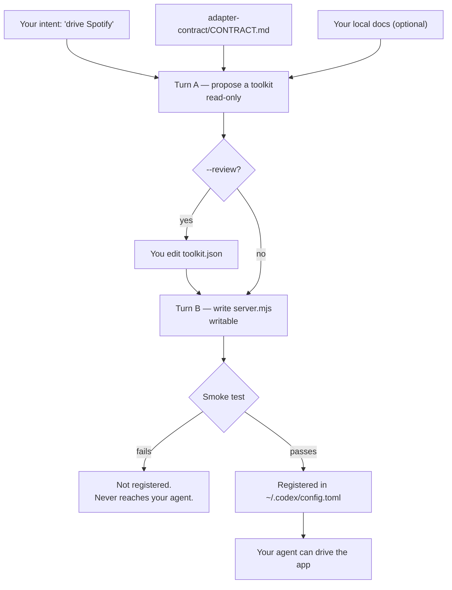

# Relay

**Codex can reason about any app on your Mac. It can't touch a single one.**

Anything without a public API — a game, a native macOS app, an internal tool your
company wrote in 2009 — is invisible to an agent. The usual fix is to write an
integration per app, by hand, forever. Most apps never get one.

Relay removes the "by hand." You describe an app you want your agent to drive, and
Relay writes the adapter for it, tests it, and registers it — **on your machine, for
your apps, in a couple of minutes.** Screen in, clicks out. No API, no plugin, no
vendor cooperation, nothing leaving the laptop.

The seven adapters in this repo aren't the product. They're the evidence that the
approach holds.

> Built at the Ramp Builders Cup. The submission form was filled out by
> `chrome-mcp`, one of the adapters in here — which then refused to click Submit,
> because that part is a human's job.

---

## Demo

📹 **[Watch the demo](https://youtu.be/9w9_2Y6DHaY)** — under 3 minutes.

<!-- screenshots: the workspace UI streaming a turn, and the generator writing an adapter -->

Relay generates a fresh adapter from a one-line intent, then Codex uses the seven
reference adapters to drive real apps — playing Minecraft, filling a web form, and
sending an iMessage — all on the laptop.

**Built with:** TypeScript · Node.js · Codex (app-server) · GPT-5.6 · MCP · JSON-RPC ·
Fastify · Next.js · React · Swift · AppleScript · SQLite · mineflayer · OBS WebSocket

---

## Make an adapter for your own app

This is the actual quickstart. Pick something on your machine that no agent can
currently touch. First get the workspace running (see
[**Running the workspace**](#running-the-workspace) below), then just **ask**:

> make a spotify mcp using applescript and register it

That's it. Codex reads the adapter contract, proposes a toolkit, writes
`adapters/spotify-mcp/server.mjs`, smoke-tests it, and registers it in your
`~/.codex/config.toml`. Hit **Reload MCP**, give it a moment to handshake, and your
agent can drive Spotify:

> play my Discover Weekly on Spotify

Describe the app however you like — the intent is the prompt. A couple of variations
that steer the generator:

> make a blender mcp — import a mesh, render a frame. show me the toolkit before you write any code.

> make a logic-pro mcp, and read the AppleScript dictionary in ~/docs/logic-scripting first

### How it decides what to build



Both turns run on **one persistent thread**, so the implementation still remembers
why it proposed each tool. The contract is embedded in the generator's own prompt,
which is why generated adapters and hand-written ones come out the same shape.

**A generated adapter that fails its smoke test is never registered.** Broken code
doesn't reach your agent.

---

## Why any app fits

Every adapter implements the same triad, defined in
[`adapter-contract/CONTRACT.md`](adapter-contract/CONTRACT.md):

1. **`observe_*`** — cheap, read-only state. Safe to call anytime, no side effects.
2. **action tools** — verbs that change the app, named for what they do.
3. **`capture_*`** — writes a file under `ARTIFACTS_DIR` and returns its path.

The triad is deliberately vague about _how_ you reach the app, and that's the whole
trick. Observing might be a network query, an accessibility tree, or a screenshot.
Acting might be a protocol message, an AppleScript event, or a synthetic click. The
agent doesn't care — it sees tools either way.

That third one matters more than it looks. **Artifacts are how apps hand off to each
other**: Minecraft exports a build as a JSON schematic, and the next adapter reads
it. Apps become composable instead of isolated.

Two rules that aren't negotiable:

- **stdout is protocol-only.** One stray byte kills the transport. Diagnostics go to
  stderr.
- **Adapters return errors, they don't throw.** A crashed adapter fails the whole turn.

---

## Proof it generalizes

Seven adapters, and the point is the right-hand column — four fundamentally
different ways of reaching an app, one contract, one agent interface.

| Adapter                                                   | Tools | How it reaches the app                                                                                                                                                                         |
| --------------------------------------------------------- | ----: | ---------------------------------------------------------------------------------------------------------------------------------------------------------------------------------------------- |
| [`minecraft-mcp`](adapters/minecraft-mcp)                 |    28 | **Network protocol.** A mineflayer bot plays real survival — gather, craft, smelt, duel, build. The live game screen is captured and returned to the model _as vision_. No `/give`, no cheats. |
| [`clash-royale-mcp`](adapters/clash-royale-mcp)           |     9 | **Synthetic input on a mirrored screen.** Card deploys go through a compiled Swift mouse driver, because AppleScript clicks weren't pixel-accurate enough to land a troop on a tile.           |
| [`imessage-listener-mcp`](adapters/imessage-listener-mcp) |     7 | **A managed local service.** Start, stop, and control trusted senders for the iMessage→Codex listener — without handing the agent shell access.                                                |
| [`messages-mcp`](adapters/messages-mcp)                   |     6 | **AppleScript + SQLite.** Sends iMessages to any number or contact; reads history straight out of `chat.db`.                                                                                   |
| [`chrome-mcp`](adapters/chrome-mcp)                       |     5 | **Injected JavaScript.** Reads and fills web forms in a live tab. Refuses submit-like controls unless explicitly opted in.                                                                     |
| [`obs-mcp`](adapters/obs-mcp)                             |     5 | **App scripting.** Scene switching and recording control.                                                                                                                                      |
| [`applescript-mcp`](adapters/applescript-mcp)             |     3 | **The escape hatch.** Arbitrary AppleScript, screenshots, frontmost-app state — so an app with no purpose-built adapter still has a path today.                                                |

If your app is reachable by _any_ of those mechanisms — and on macOS almost
everything is — it can be an adapter.

---

## How Codex & GPT-5.6 power Relay

Codex isn't a feature bolted onto Relay — it's the whole runtime. Relay spawns
`codex app-server` as a child process and drives it over newline-delimited JSON-RPC
on stdio. Every action is a Codex turn running on **GPT-5.6**: the app-server
resolves the account's frontier model (GPT-5.6-Sol), and the workspace UI exposes a
picker across the GPT-5.6 family via `model/list`.

Codex does the work in two places:

- **Generating adapters** — two turns on one persistent thread. Turn A runs
  read-only and has GPT-5.6 propose a toolkit from the contract and the app's docs;
  Turn B, scoped to write only inside `adapters/` with no network access, writes the
  real `server.mjs`. Sharing a thread means the implementation still knows _why_ each
  tool was proposed.
- **Driving apps** — at runtime the backend never calls an adapter tool itself. It
  starts a turn and streams the events back; GPT-5.6 decides which MCP tools to call,
  and in what order, to satisfy the request.

We also built Relay _with_ Codex during the hackathon — and one of our own adapters,
`chrome-mcp`, filled out a submission form for us, then refused to click Submit.

---

## Running the workspace

The generator alone needs nothing but the `codex` CLI. To watch your agent drive
apps in a UI:

```bash
npm run dev:backend                          # Fastify + codex app-server on :4000
cd frontend && npm install && npm run dev    # workspace UI on :3000
```

A Fastify backend drives `codex app-server` over newline-delimited JSON-RPC and
streams turns to a Next.js workspace as Server-Sent Events. Each adapter is an
independent child process speaking MCP on stdio.

Adapters generated by Relay register themselves. To add one by hand:

```toml
[mcp_servers.minecraft-mcp]
command = "node"
args = ["/abs/path/to/codex-adapters/adapters/minecraft-mcp/server.mjs"]

[mcp_servers.minecraft-mcp.env]
ARTIFACTS_DIR = "/abs/path/to/codex-adapters/data/artifacts"
```

Then hit **Reload MCP** in the UI (or `curl -XPOST localhost:4000/api/mcp/reload`).
Give it a moment before prompting — reload returns as soon as the config is re-read,
and a server mid-handshake exposes no tools yet.

### macOS permissions

Driving real apps means the OS gets a say. Grant these once:

| Need                    | Where                                                              |
| ----------------------- | ------------------------------------------------------------------ |
| Any AppleScript adapter | System Settings → Privacy → **Automation**                         |
| `chrome-mcp`            | Chrome → View → Developer → **Allow JavaScript from Apple Events** |
| Reading `chat.db`       | System Settings → Privacy → **Full Disk Access**                   |
| Synthetic clicks        | System Settings → Privacy → **Accessibility**                      |

Without the Chrome setting every JS call fails with `-2700`; the adapter detects that
case and returns the instruction instead of a generic error.

---

## Layout

```
adapters/            one stdio MCP server per app — generated or hand-written
  _shared/           debug-log.mjs, shared by every adapter
adapter-contract/    CONTRACT.md — the spec humans and the generator both follow
backend/src/
  codex/             app-server client, transport, protocol types, UI stream mapping
  generator.ts       the two-turn authoring flow
  registry.ts        smoke test, config.toml registration, verify, unregister
  server.ts          Fastify: /api/chat (SSE), /api/mcp/*, /artifacts
frontend/            Next.js + shadcn workspace UI
```

---

## Debugging

Every adapter logs verbosely to stderr and a file — **never stdout**:

```bash
tail -f $TMPDIR/codex-adapter-logs/messages-mcp.log
```

Entries are JSON: `tool.call.start`, `applescript.run.end`, `fill_field.result`,
`rpc.received`. `ADAPTER_DEBUG=0` disables, `ADAPTER_LOG_DIR` relocates.

**If the agent claims it "can't" do something, it almost certainly has no tool for
it.** Check what's loaded before debugging the adapter:

```bash
curl -s localhost:4000/api/mcp/servers | jq '.servers[] | {name, tools: (.tools|length)}'
```

A server showing `0` tools is connected but useless — it either failed to start or
hasn't finished handshaking.

One known gotcha: Codex's built-in `apps` connector mounts ~125 remote tools next to
your local ones. Small models then pick from ~150 tools, miss the local ones, and
answer "I can't do that" instead of calling your adapter. Launching app-server with
`--disable apps` cuts it back to just this repo's tools.

---

## Things that cost us hours

Driving real desktop software is mostly a fight with undocumented behavior. Each is
written up properly in its adapter's README:

- **macOS is quietly gutting the Messages AppleScript dictionary.** Half the
  documented properties now throw `-1728`. The adapter routes around the missing ones
  and reports whether a send was _confirmed_ rather than assuming success.
- **`send` blocks on a reply that never comes** for an existing thread — but a
  brand-new conversation needs that round trip to deliver. Two send paths, chosen by
  whether a thread already exists.
- **CSS `nth-of-type` is not a document index.** It counts siblings under one parent.
  Using it as "the Nth input on the page" silently broke every checkbox on our first
  live run. Selectors are now full ancestor paths, verified to resolve back to the
  element.
- **React ignores direct `.value` assignment**, so a field looks filled and submits
  empty. Writes go through the prototype's native setter, dispatch `input` and
  `change`, then read back to prove it stuck.
- **Truncated echoes make false negatives.** A verification field capped at 300 chars
  never equals a 4000-char write — comparing them reports failure on a perfect fill.

---

## Safety

Filling a form is reversible. Submitting it is not.

`chrome-mcp` refuses to click anything matching
`submit|save|confirm|send|post|publish|finish` unless the caller passes
`allowSubmit: true`. That guard lives in the adapter, not in a prompt, so an agent
that gets confused fills the form and stops.

The same principle runs through the repo, and the generator bakes it into what it
writes: `observe_*` and `capture_*` are always safe, actions are explicit, and the
irreversible step is opt-in.

---

## Team

Built by @ryankamiri, @AadiBiyani, and @kilehsu.
