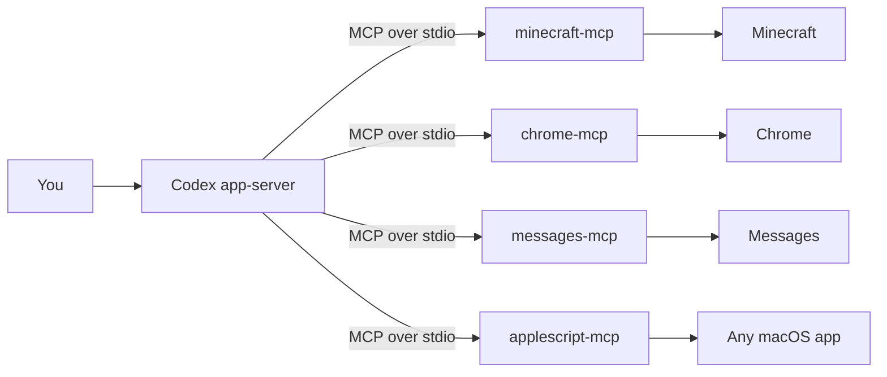

# Relay

**Codex can reason about any app on your Mac. It can't touch a single one.**

Anything without a public API — a game, a native macOS app, an internal desktop
tool — is invisible to an agent. The usual fix is to write an integration per app,
by hand, forever. Most apps never get one.

Relay gives Codex hands. Point it at an application and it generates a local **MCP
adapter**: a small stdio server that turns that app into tools the agent can call.
Screen in, clicks out. No API, no plugin, no vendor cooperation, and nothing leaves
the laptop.

> Built at the Ramp Builders Cup. The submission form was filled out by
> `chrome-mcp`, one of the adapters in this repo — which then refused to click
> Submit, because that part is a human's job.

---

## What it looks like



A Fastify backend drives `codex app-server` over newline-delimited JSON-RPC and
streams turns to a Next.js workspace UI as Server-Sent Events. Each adapter is an
independent child process speaking MCP on stdio.

---

## Quickstart

**Prerequisites:** macOS, Node 20+, and the `codex` CLI on your `PATH`.

```bash
git clone https://github.com/ryankamiri/codex-adapters
cd codex-adapters
npm install

npm run dev:backend          # Fastify + codex app-server on :4000
cd frontend && npm install && npm run dev   # workspace UI on :3000
```

Register the adapters you want in `~/.codex/config.toml`:

```toml
[mcp_servers.minecraft-mcp]
command = "node"
args = ["/abs/path/to/codex-adapters/adapters/minecraft-mcp/server.mjs"]

[mcp_servers.minecraft-mcp.env]
ARTIFACTS_DIR = "/abs/path/to/codex-adapters/data/artifacts"
```

Then hit **Reload MCP** in the UI (or `curl -XPOST localhost:4000/api/mcp/reload`).
Give it a moment before prompting — reload returns as soon as the config is
re-read, and a server that hasn't finished its handshake exposes no tools yet.
`GET /api/mcp/servers` lists what each server is actually offering.

### macOS permissions

Driving real apps means the OS gets a say. Grant these once:

| Need | Where |
| --- | --- |
| Any AppleScript adapter | System Settings → Privacy → **Automation** |
| `chrome-mcp` | Chrome → View → Developer → **Allow JavaScript from Apple Events** |
| Reading `chat.db` | System Settings → Privacy → **Full Disk Access** |
| Synthetic clicks | System Settings → Privacy → **Accessibility** |

Without the Chrome setting every JS call fails with `-2700`; the adapter detects
that specific case and returns the instruction instead of a generic error.

---

## The contract

Every adapter implements the same triad, defined in
[`adapter-contract/CONTRACT.md`](adapter-contract/CONTRACT.md):

1. **`observe_*`** — cheap, read-only state. Safe to call anytime, no side effects.
2. **action tools** — verbs that change the app, named for what they do.
3. **`capture_*`** — writes a file under `ARTIFACTS_DIR` and returns its path.

That third one is the interesting one. **Artifacts are how apps hand off to each
other**: Minecraft exports a build as a JSON schematic, and the next adapter reads
it. The contract is what makes apps composable rather than isolated.

Two rules that are not negotiable:

- **stdout is protocol-only.** One stray byte kills the transport. Diagnostics go
  to stderr.
- **Adapters return errors, they don't throw.** A crashed adapter fails the whole
  turn.

---

## Adapters

| Adapter | Tools | What it drives |
| --- | --: | --- |
| [`minecraft-mcp`](adapters/minecraft-mcp) | 28 | Real survival via a mineflayer bot — gather, craft, smelt, fight, build. First-person POV rendered headless and returned to the model **as vision**. No `/give`, no cheats. |
| [`clash-royale-mcp`](adapters/clash-royale-mcp) | 9 | Plays a live match on a mirrored phone; card deploys go through a compiled Swift mouse driver for pixel accuracy. |
| [`imessage-listener-mcp`](adapters/imessage-listener-mcp) | 7 | Manages the iMessage→Codex listener service — start, stop, and control trusted senders without shell access. |
| [`messages-mcp`](adapters/messages-mcp) | 6 | Sends iMessages to any number or contact; reads chats. |
| [`chrome-mcp`](adapters/chrome-mcp) | 5 | Reads and fills web forms through injected JavaScript. **Refuses submit-like controls** unless explicitly opted in. |
| [`obs-mcp`](adapters/obs-mcp) | 5 | Scene switching and recording. |
| [`applescript-mcp`](adapters/applescript-mcp) | 3 | The escape hatch: arbitrary AppleScript, screenshots, frontmost-app state. Anything without a purpose-built adapter still has a path. |

---

## The generator

The point isn't any single adapter — it's that Relay writes them.

```bash
npm run generate -- new blender --intent "drive Blender: import a mesh, render a frame"
```

The flow is **propose → review → generate → smoke test → register → verify**. The
adapter contract is embedded in the generator's own prompt, so generated adapters
and hand-written ones satisfy the same spec. A generated server that fails its
smoke test is never registered, so it never reaches the agent.

Pass `--review` to approve the proposed tool surface before any code is written.

---

## Layout

```
adapters/            one stdio MCP server per app
  _shared/           debug-log.mjs, shared by every adapter
adapter-contract/    CONTRACT.md — the spec both humans and the generator follow
backend/src/
  codex/             app-server client, transport, protocol types, UI stream mapping
  generator.ts       adapter authoring
  registry.ts        smoke test + config.toml registration
  server.ts          Fastify: /api/chat (SSE), /api/mcp/reload, /artifacts
frontend/            Next.js + shadcn workspace UI
```

---

## Debugging

Every adapter logs verbosely to stderr and a file — **never stdout**:

```bash
tail -f $TMPDIR/codex-adapter-logs/messages-mcp.log
```

Entries are JSON: `tool.call.start`, `applescript.run.end`, `fill_field.result`,
`rpc.received`. Set `ADAPTER_DEBUG=0` to disable, `ADAPTER_LOG_DIR` to relocate.

**If the agent claims it "can't" do something, it almost certainly has no tool for
it.** Check what's actually loaded before you debug the adapter:

```bash
curl -s localhost:4000/api/mcp/servers | jq '.servers[] | {name, tools: (.tools|length)}'
```

A server showing `0` tools is connected but useless — it either failed to start or
hasn't finished handshaking.

One known gotcha: Codex's built-in `apps` connector mounts ~125 remote tools
alongside your local ones. Small models start picking from ~150 tools and miss the
local ones entirely, answering "I can't do that" instead of calling the adapter.
Launching app-server with `--disable apps` cuts it back to just this repo's tools.

---

## Things that cost us hours

Driving real desktop software is mostly a fight with undocumented behavior. These
are written up properly in each adapter's README:

- **macOS is quietly gutting the Messages AppleScript dictionary.** Half the
  documented properties now throw `-1728`. The adapter routes around the missing
  ones and reports whether a send was *confirmed* rather than assuming success.
- **`send` blocks on a reply that never comes** for an existing thread — but a
  brand-new conversation needs that round trip to deliver. Two send paths, chosen
  by whether a thread already exists.
- **CSS `nth-of-type` is not a document index.** It counts siblings under one
  parent. Using it as "the Nth input on the page" silently broke every checkbox on
  our first live run. Selectors are now full ancestor paths, verified to resolve
  back to the element.
- **React ignores direct `.value` assignment**, so a field looks filled and submits
  empty. Writes go through the prototype's native setter, dispatch `input` and
  `change`, then read back to prove it stuck.
- **Truncated echoes make false negatives.** A verification field capped at 300
  chars will never equal a 4000-char write — comparing them reports failure on a
  perfect fill.

---

## Safety

Filling a form is reversible. Submitting it is not.

`chrome-mcp` refuses to click anything matching `submit|save|confirm|send|post|publish|finish`
unless the caller passes `allowSubmit: true`. That guard lives in the adapter, not
in a prompt, so an agent that gets confused fills the form and stops.

The same principle runs through the repo: `observe_*` and `capture_*` are always
safe, actions are explicit, and the irreversible step is opt-in.
